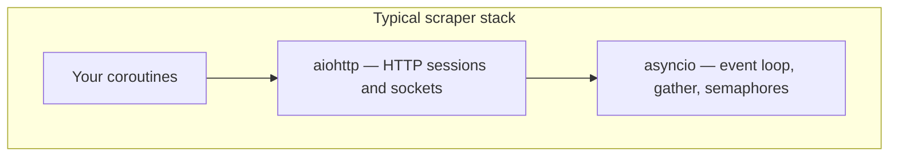
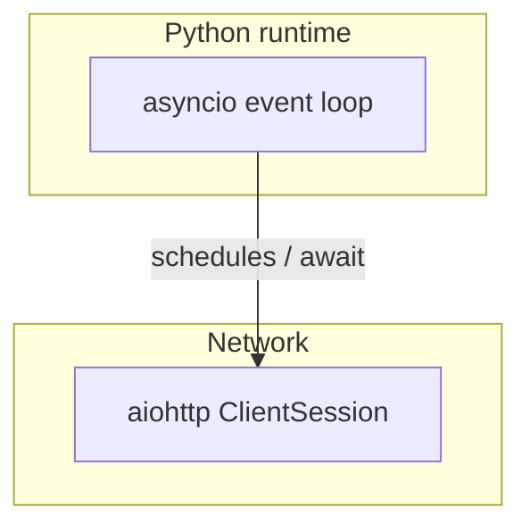
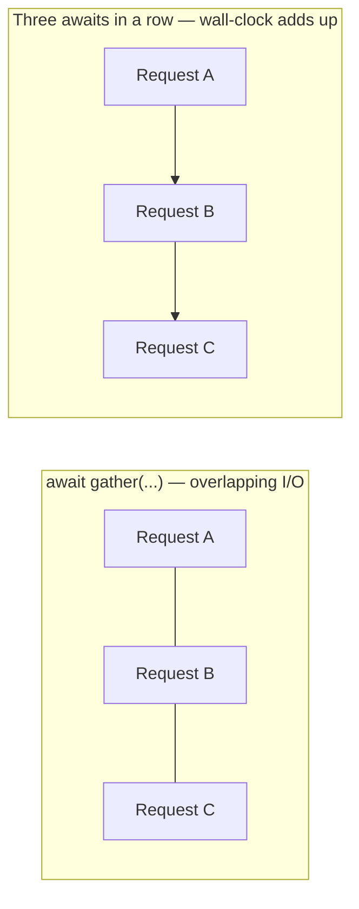
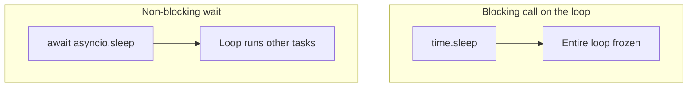
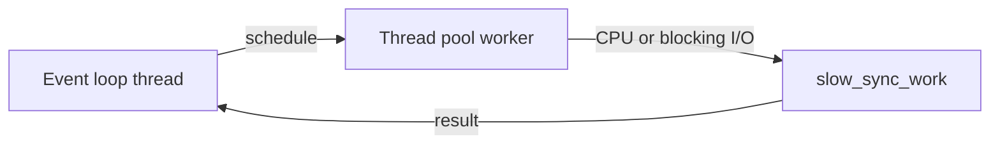

## `asyncio` vs `aiohttp`

They serve completely different purposes but work together:

### `asyncio` -- The Engine

`asyncio` is **Python's built-in async runtime**. It provides:

- **The event loop** -- the scheduler that decides which coroutine runs next
- **Coroutine primitives** -- `async def`, `await`, `asyncio.gather()`, `asyncio.sleep()`
- **Synchronization tools** -- `Semaphore`, `Lock`, `Event`, `Queue`
- **Task management** -- creating, cancelling, and waiting on tasks

It knows **nothing** about HTTP, web requests, or networking protocols. It's the foundation that everything async sits on top of.

```python
import asyncio

async def do_something():
    await asyncio.sleep(1)       # non-blocking wait
    return "done"

async def main():
    results = await asyncio.gather(  # run concurrently
        do_something(),
        do_something(),
        do_something(),
    )

asyncio.run(main())
```

### `aiohttp` -- The HTTP Client (and Server)

`aiohttp` is a **third-party library** that provides an async HTTP client and server, built **on top of** `asyncio`. It's essentially the async equivalent of `requests`.

- **Client side** -- make HTTP requests (GET, POST, etc.) without blocking
- **Server side** -- build async web servers (alternative to Flask/FastAPI)
- **Connection pooling** -- reuse TCP connections across requests via `TCPConnector`
- **Timeouts, redirects, cookies, headers** -- all the HTTP plumbing

```python
import aiohttp

async def fetch(url):
    async with aiohttp.ClientSession() as session:
        async with session.get(url) as response:
            return await response.text()
```

### Analogy

| Concept | Analogy |
| --- | --- |
| `asyncio` | The **operating system** -- schedules tasks, manages concurrency |
| `aiohttp` | An **application** -- uses the OS to do HTTP work |

You can use `asyncio` without `aiohttp` (e.g., for async file I/O, timers, or working with other async libraries). But you **cannot** use `aiohttp` without `asyncio` -- it depends on it.



### How They Combine in Your File

In your `scraping_pages.py`:

- **`asyncio`** provides: `Semaphore` (throttling), `gather` (run all scrapes concurrently), `get_event_loop` + `run_in_executor` (offload HTML parsing to a thread)
- **`aiohttp`** provides: `ClientSession` (make HTTP requests), `TCPConnector` (connection pool), `ClientTimeout` (request timeouts), `ClientError` (error handling)

In short: `asyncio` orchestrates *when* things run, `aiohttp` handles *what* runs (HTTP requests).



---

## Writing `async`/`await` Correctly in Python

### 1. The Basics

Any function that uses `await` **must** be declared with `async def`:

```python
async def fetch_data():
    result = await some_async_operation()
    return result
```

You can only `await` things that are **awaitable** (coroutines, tasks, futures). You **cannot** `await` a regular function:

```python
# WRONG -- requests.get is synchronous, not awaitable
async def bad():
    result = await requests.get("https://example.com")

# RIGHT -- aiohttp returns an awaitable
async def good():
    async with aiohttp.ClientSession() as session:
        async with session.get("https://example.com") as resp:
            result = await resp.text()
```

### 2. Running Async Code

You need an entry point to start the event loop:

```python
import asyncio

async def main():
    data = await fetch_data()
    print(data)

# From synchronous code, kick off the loop:
asyncio.run(main())
```

**Never** call `asyncio.run()` from inside an already-running loop (e.g., inside another `async` function). That will raise an error.

### 3. Concurrency with `gather`

The whole point of async is running things **concurrently**. Use `asyncio.gather`:

```python
async def main():
    # These run concurrently, NOT sequentially
    a, b, c = await asyncio.gather(
        fetch_page("https://site1.com"),
        fetch_page("https://site2.com"),
        fetch_page("https://site3.com"),
    )
```

Compare with the **wrong** way (runs sequentially, no benefit over sync):

```python
async def main():
    # This defeats the purpose -- each one waits for the previous
    a = await fetch_page("https://site1.com")
    b = await fetch_page("https://site2.com")
    c = await fetch_page("https://site3.com")
```



### 4. `async with` (Async Context Managers)

For resources that need async setup/teardown (sessions, connections):

```python
async with aiohttp.ClientSession() as session:
    # session is open here
    async with session.get(url) as response:
        data = await response.read()
# session is automatically closed here
```

### 5. `async for` (Async Iterators)

For streams of data that arrive asynchronously:

```python
async for chunk in response.content.iter_any():
    process(chunk)
```

### 6. Common Mistakes

| Mistake | Why It's Wrong |
| --- | --- |
| Calling `async` function without `await` | Returns a coroutine object, never executes |
| Using `time.sleep()` in async code | Blocks the **entire** event loop |
| Using `requests` in async code | Blocks the event loop (use `aiohttp` instead) |
| Calling `asyncio.run()` inside async | Can't nest event loops |

```python
# WRONG -- blocks the whole loop for 5 seconds
async def bad():
    time.sleep(5)

# RIGHT -- yields control back to the loop
async def good():
    await asyncio.sleep(5)
```



### 7. Mixing Sync and Async

If you **must** call a blocking/sync function from async code, offload it to a thread:

```python
import asyncio

def slow_sync_work(data):
    # CPU-heavy or blocking I/O
    return process(data)

async def main():
    loop = asyncio.get_event_loop()
    result = await loop.run_in_executor(None, slow_sync_work, my_data)
```



This is exactly what your `scraping_pages.py` does on line 81 -- it offloads `parse_html_content` (CPU-bound BeautifulSoup parsing) to a thread pool so it doesn't block the event loop.

### TL;DR Rules

1. `async def` for any function that `await`s something
2. `await` every async call -- forgetting it means the code never runs
3. Use `asyncio.gather()` to run things concurrently
4. Never use blocking calls (`time.sleep`, `requests`, file I/O) inside async -- use their async equivalents or `run_in_executor`
5. One `asyncio.run()` at the top level to start everything
