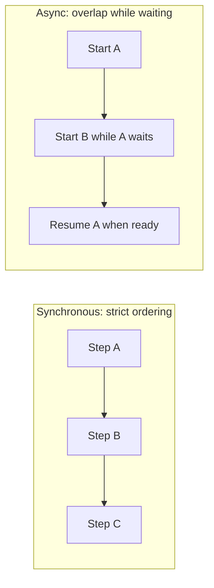
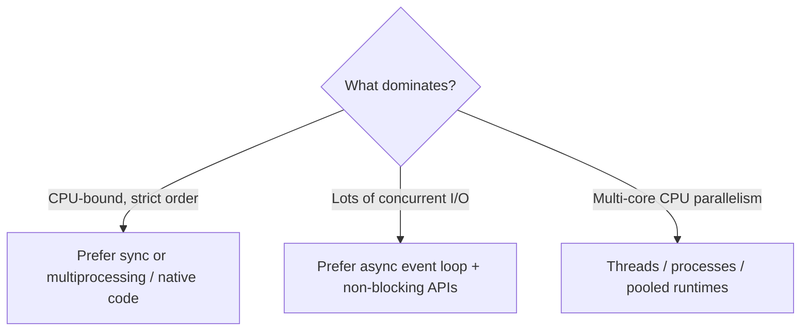
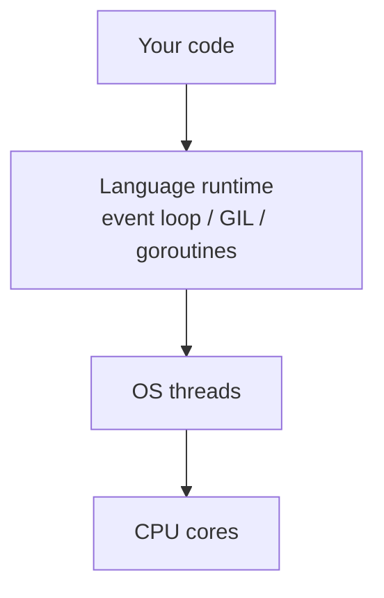
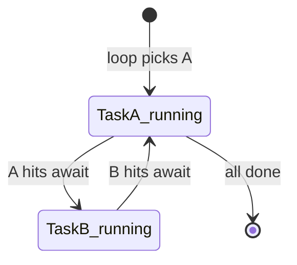
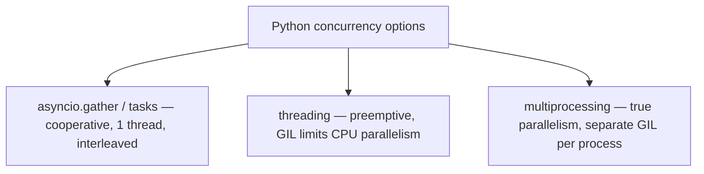
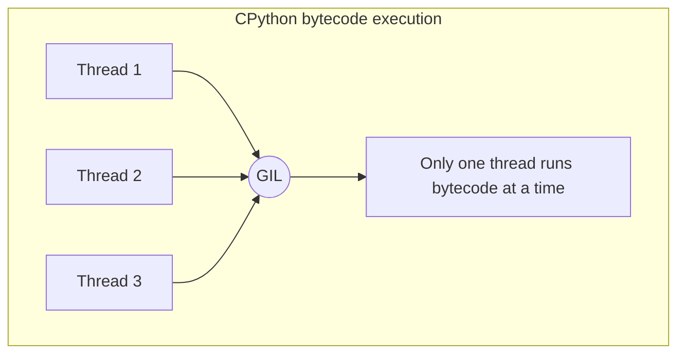
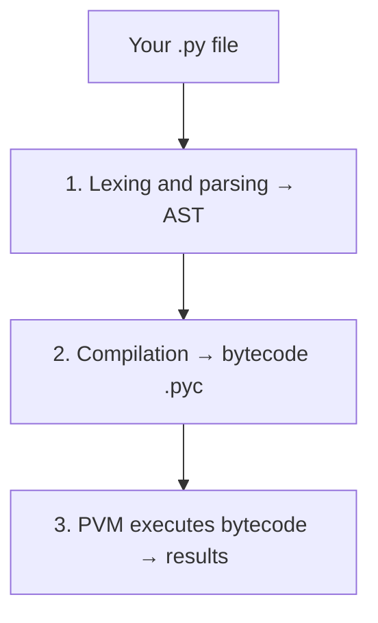

## Synchronous vs Asynchronous

**Synchronous (sync)** and **asynchronous (async)** are two fundamental execution models that determine **how** and **when** tasks run in a program. The choice between them — and how it is implemented — varies significantly across programming languages.

### The core concepts

In **synchronous** code, each operation must complete before the next one begins — the thread is *blocked* while waiting. Think of a single cashier at checkout: the next customer cannot be served until the current one is done.

In **asynchronous** code, a task is *started* and the program immediately moves on to other work, handling the result later (via callbacks, promises, or `async/await`). The cashier takes an order, sends it to the kitchen, and serves the next customer while the first order is prepared.



### Single-threaded vs multi-threaded languages

| Language | Threading model | Async mechanism | Notes |
| --- | --- | --- | --- |
| **JavaScript** | Single-threaded | Event loop, Promises, `async/await` | Non-blocking I/O via the event loop |
| **Python** | Single-threaded (effectively) | `asyncio`, `async/await` | GIL limits true parallel threads; use `multiprocessing` for CPU tasks |
| **Java** | Multi-threaded | `CompletableFuture`, Virtual Threads (Java 21+) | Native OS threads; strong for CPU-bound parallel work |
| **Go** | Multi-threaded | Goroutines + channels | Lightweight, runtime-managed green threads |
| **C#** | Multi-threaded | `async/await`, `Task`, TPL | `async/await` does not create a new thread per `await` by default |
| **Rust** | Multi-threaded | `async/await`, Tokio runtime | Memory-safe concurrency with zero-cost abstractions |
| **Ruby** | Single-threaded (GIL) | Fibers, `async` gem | Similar GIL limitation to Python |
| **Node.js** | Single-threaded | Event loop (libuv) | Worker Threads for CPU work |

### How each language handles async differently

**JavaScript / Node.js** — non-blocking I/O on a single thread:

```javascript
const data = await fetch('https://api.example.com/data');
```

**Python** — the **GIL** means only one thread executes Python bytecode at a time. `asyncio` provides cooperative async for I/O-bound tasks; use `multiprocessing` for CPU-bound parallelism:

```python
async def fetch_data():
    async with aiohttp.ClientSession() as session:
        response = await session.get(url)
        return await response.text()
```

**Java / C#** — truly multi-threaded. Java 21 *Virtual Threads* are lightweight like Go goroutines. C# `async/await` uses a thread pool: the thread is freed while waiting, then a continuation runs when the task completes.

**Go** — **goroutines** are scheduled by Go's runtime, not one-per-OS-thread. Millions are cheap; **channels** coordinate communication.

### When to use which

- **Sync** → CPU-intensive work where strict ordering matters (math, image processing, transforms)
- **Async (single-threaded)** → High-concurrency I/O: web servers, DB queries, API calls (JS, Python `asyncio`)
- **Multi-threaded / multi-process** → True CPU parallelism: encoding, ML inference, scientific computing (Java, Go, C#, Rust, Python `multiprocessing`)

FastAPI is async-native: each request does not block others during I/O waits, which is why it scales well despite the GIL.



---

## From hardware to your code

### Layer 1: The CPU

A modern CPU has multiple **cores**; each core runs one thread at a time. **Hyperthreading** can expose two logical cores per physical core. The CPU only understands machine instructions — not Python or JavaScript.

Execution is fetch → decode → execute in a loop. **Interrupts** pause that loop when hardware events occur (keyboard, network packet, disk I/O complete). The CPU jumps to an **interrupt handler**. That is how async I/O works at the lowest level — the kernel is notified by hardware instead of the CPU polling in a busy loop.

### Layer 2: The operating system

The OS schedules **OS threads** onto cores via algorithms like Linux **CFS**. A **context switch** saves one thread's registers and loads another's. On a 12-core CPU, at most 12 threads run truly in parallel at any instant; everything else waits, blocks on I/O, or sleeps. Time-slicing creates the illusion of thousands of concurrent threads.


### Layer 3: Language runtimes



#### JavaScript / Node.js

One OS thread runs your JS. On `await fetch(...)`, work is delegated to the OS (`epoll` on Linux, `kqueue` on macOS). The kernel watches the socket; the JS thread stays free. When data is ready, an interrupt fires, **libuv** queues a callback, and the **event loop** runs it on the main thread.

CPU-bound work can use libuv's **thread pool** (default 4 threads) so the event loop is not blocked.

#### Python

Real OS threads exist, but the **GIL** lets only one thread run Python bytecode at a time. `asyncio` is a single-threaded event loop: coroutines **voluntarily yield** at `await`. If a coroutine never awaits, it blocks everything.

**multiprocessing** spawns separate processes — each with its own GIL — for real multi-core CPU work (e.g. multiple Gunicorn workers).

#### Java

Threads map **1:1 to OS threads** (no GIL). Expensive at scale (~1 MB stack each). **Virtual Threads** (Java 21+) are JVM-managed and lightweight.

#### Go

**M:N scheduling**: N goroutines on M OS threads across all cores. The **G-M-P** model: **P** (processor) holds a goroutine queue. Blocking I/O parks a goroutine and reuses the OS thread for another.

#### C# / Rust

C# `async/await` schedules **continuations** on a **thread pool** — not necessarily the same thread after `await`. Rust needs an explicit runtime (e.g. **Tokio**) with a similar poll-based executor.

### Full hardware picture

| Language | OS threads | CPU use for app logic | I/O strategy |
| --- | --- | --- | --- |
| **JavaScript** | 1 main + libuv pool | ~1 core for JS | Kernel events (`epoll`/`kqueue`) |
| **Python (asyncio)** | 1 (GIL-bound) | ~1 core for Python bytecode | `asyncio` + kernel (`epoll`) |
| **Python (multiprocessing)** | Multiple processes | Full multi-core | Per-process GIL |
| **Java** | 1:1 OS threads | Full multi-core | Threads or NIO |
| **Go** | M OS threads | Full multi-core | Runtime parks goroutines on I/O |
| **C#** | Thread pool | Full multi-core | Task continuations |
| **Rust (Tokio)** | Thread pool | Full multi-core | Poll-based executor |

**FastAPI mental model:** `asyncio` event loop → one OS thread → kernel `epoll` for I/O. `await` on a DB call frees the thread for other requests. A CPU-heavy call **without** `await` freezes the entire loop.

---

## Asyncio is not threading

`asyncio` does **not** put tasks on another thread by default. It runs on **one thread** with cooperative scheduling — no OS context switches between coroutines; the event loop switches between coroutine frames in userspace.

```python
import asyncio

async def task1():
    print("Task 1 start")
    await asyncio.sleep(2)   # voluntarily yields
    print("Task 1 done")

async def task2():
    print("Task 2 start")
    await asyncio.sleep(1)
    print("Task 2 done")

asyncio.run(asyncio.gather(task1(), task2()))
# Task 1 start → Task 2 start → Task 2 done → Task 1 done
```

### When asyncio uses threads

For **blocking sync code** inside async code, use `asyncio.to_thread()` or `loop.run_in_executor()`:

```python
async def main():
    result = await asyncio.to_thread(blocking_sync_function)
```

Calling `time.sleep(3)` directly inside `async def` **freezes the event loop** for 3 seconds.

| Model | Analogy |
| --- | --- |
| **Sync** | One chef, one dish at a time start-to-finish |
| **asyncio** | One chef: starts dish 1, works on dish 2 while waiting, returns to dish 1 |
| **Threading** | Multiple chefs in parallel |
| **asyncio.to_thread()** | Chef hires a helper for one blocking step |

---

## Asyncio as cooperative multitasking

| Type | Who switches? | Threads? | Python |
| --- | --- | --- | --- |
| **Preemptive** | OS interrupts tasks | Yes | `threading` |
| **Cooperative** | Tasks yield at `await` | No (one thread) | `asyncio` |

The event loop runs one task until `await`, then picks the next ready task. `asyncio.gather()` schedules coroutines together — they **interleave**, not run in parallel on multiple cores.



```python
async def bad_task():
    import time
    time.sleep(5)  # blocks entire loop

async def good_task():
    await asyncio.sleep(5)  # yields; others can run
```

### Hierarchy of Python concurrency



---

## Why fast Python packages use Rust

Python is slow for raw computation: interpreted bytecode, GC overhead, and the **GIL** cap CPU parallelism in pure Python threads.

**Rust** offers:

- Native machine code (near C/C++ speed)
- **Zero-cost abstractions**
- No GC — ownership at compile time
- Memory safety without segfault-prone C extensions
- True parallelism when the extension **releases the GIL**

**PyO3** + **Maturin** expose Rust functions as normal Python callables — keep orchestration in Python, hot paths in Rust.

| Package | Role | Why Rust |
| --- | --- | --- |
| **Polars** | DataFrames | Fast columnar ops vs Pandas |
| **Pydantic V2** | Validation (`pydantic-core`) | FastAPI uses this daily |
| **Ruff** | Linter | Milliseconds vs seconds |

Python is the architect; Rust is the construction crew. Native extensions run outside the GIL during heavy work — another reason they outperform pure Python on multi-core machines.


---

## The GIL explained

The **Global Interpreter Lock** is a mutex in **CPython** allowing **only one thread to execute Python bytecode at a time**, even on many-core hardware.



### Why it exists

CPython uses **reference counting** per object. Two threads updating the same object's count without synchronization causes **race conditions** and memory corruption. The GIL is one global lock instead of per-object locks everywhere.

> Only the thread holding the GIL runs Python bytecode at that moment.

The GIL is released periodically (~5 ms switching interval by default) and when a thread blocks on I/O — so **I/O-bound** threaded code can still make progress. **CPU-bound** Python threads do not gain true parallelism.

| Task type | GIL impact |
| --- | --- |
| **CPU-bound** | Threads do not parallelize bytecode |
| **I/O-bound** | Thread releases GIL while waiting — often fine |

**Python 3.13+** offers experimental **free-threaded** (no GIL) mode — opt-in, still maturing.

### Escaping the GIL today

- `multiprocessing` — separate processes, separate GILs
- Rust/C extensions — release GIL during native work
- `asyncio` — single-threaded I/O concurrency
- NumPy / PyTorch — heavy work in native code outside the GIL

---

## CPython and bytecode

**CPython** is the default Python implementation, written in **C**. Running `python script.py` uses it (vs PyPy, Jython, etc.).

### Execution pipeline



**AST** — tree of assignments, calls, operators. **Bytecode** — portable instructions for the **Python Virtual Machine (PVM)**, cached in `__pycache__/`. The PVM loop: read instruction → execute → repeat.

Inspect bytecode:

```python
import dis

def add(a, b):
    return a + b

dis.dis(add)
# LOAD_FAST, LOAD_FAST, BINARY_OP, RETURN_VALUE
```

Bytecode is platform-independent but **version-specific** (3.11 ≠ 3.9 instruction sets).

### Why slower than Rust or C

The PVM interprets bytecode with per-instruction overhead (C calls, type checks). Rust/C compile to **machine code** the CPU runs directly — no VM in between. That gap is why the same algorithm can be 10–75× faster in Rust, and why Rust-backed Python libraries matter for hot paths.

---

## Key takeaways

1. **Async** is about not blocking while waiting on I/O; it is not automatic multi-core parallelism in Python.
2. **asyncio** = cooperative multitasking on **one thread**; use `to_thread` / `multiprocessing` when you need threads or cores.
3. The **GIL** protects reference counting; it limits CPU parallelism in threads but I/O often still scales.
4. **CPython** runs **bytecode** on the PVM; Rust extensions skip that path for critical loops and can release the GIL.
5. As a **FastAPI** developer: keep routes async and non-blocking; never run long CPU work on the event loop without offloading.
